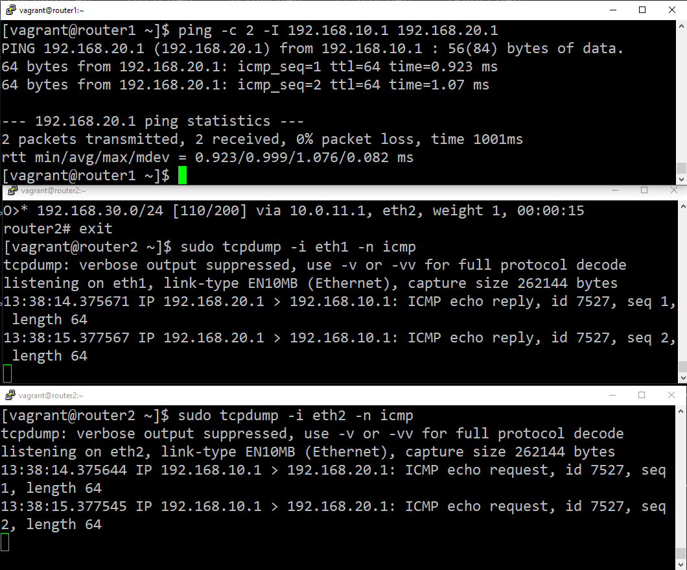
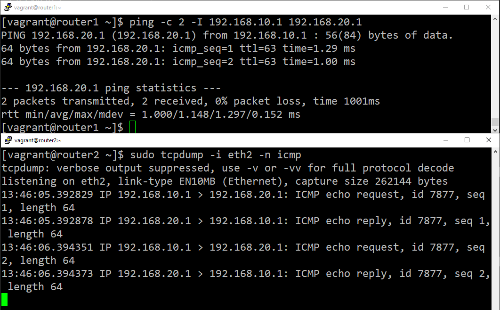

## OTUS Administrator Linux. Professional ДЗ №20: Статическая и динамическая маршрутизация, OSPF

**Задание**

Для выполнения домашнего задания используйте методичку
https://docs.google.com/document/d/1c3p-2PQl-73G8uKJaqmyCaw_CtRQipAt/edit?usp=share_link&ouid=104106368295333385634&rtpof=true&sd=true

1. Поднять три виртуалки
2. Объединить их разными vlan
3. поднять OSPF между машинами на базе Quagga;
4. изобразить ассиметричный роутинг;
5. сделать один из линков "дорогим", но что бы при этом роутинг был симметричным.

Формат сдачи: Vagrantfile + ansible

**_Решение_**
Решено при помощи vagrant + ansible.

Для иллюстрации асимметричного роутинга на eth1 router1 поставлена стоимость 1000.
Это приводит к тому, что при проверке доступности 192.168.20.1:

- запросы идут на router3, оттуда на router2
- ответы идут напрямую на router1

Скриншот проверки tcpdump:

На скриншоте видно, что запросы приходят через eth2 (подключен к router3), а ответы идут через eth1 (подключен к router1)

Для превращения асимметричного роутинга в симметричный - также поднимем стоимость eth1 до 1000.
Для удобства сделана переменная symmetric_routing. Вызовем ansible-playbook, передав её новое значение.

```
 ansible-playbook -i ansible/hosts ansible/playbook.yml --tags setup_ospf -e "{'symmetric_routing':true}"
```

Это приведёт к тому, что при проверке доступности 192.168.20.1 и запросы и ответы пойдут через router3 (через интерфейс eth2).

Скриншот проверки:

